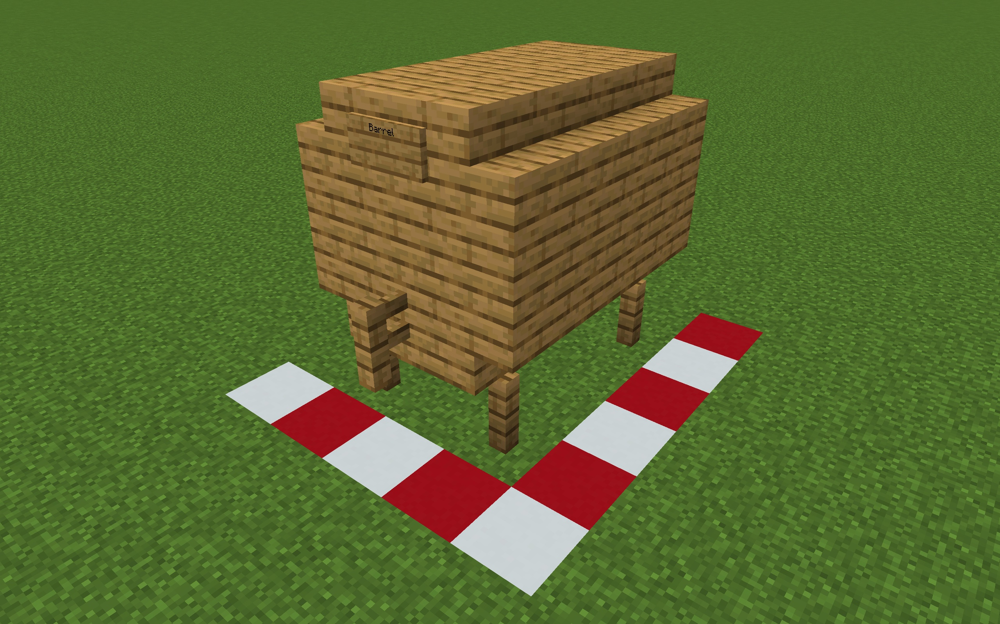

# Brewery

На сервере есть плагин **Brewery,** с помощью него вы можете варить вкуснейшие напитки, ниже будет гайд!

## Как же варить напитки?

> Варка состоит всего из трех этапов: ферментация, дистилляция, настаивание. Не для всех напитков требуются все три этапа, это будет прописано в рецепте. Подробно о каждом из них:

## Ферментация

> Для ферментации напитка вам понадобится котел, наполненный водой, под которым расположен открытый огонь (чтобы он не гас, можно зажечь его на незераке). Так же подойдут блок магмы, блок лавы и костер. Котлы можно ставить вплотную друг к другу, главное чтобы под каждым был источник тепла, указанный выше. После того как котел будет готов, нужно взять в руку ингредиенты, указанные в рецепте и нажать по котлу ПКМ. В каждом рецепте так же будет указано время ферментации. Чтобы его отслеживать можно взять простые часы и кликнуть ими ПКМ по котлу, в чате появится сообщение о том, сколько времени прошло с момента загрузки последнего ингредиента (в минутах). Время начинает отображаться только с третьей минуты, в течение первых двух вы будете получать сообщение «Котел только начал кипеть». Когда пройдет указанное в рецепте время, нужно взять в руки пустую бутылочку и кликнуть ПКМ по котлу, так содержимое из котла переместится в нее. Всего за один раз из полного котла можно собрать 3 бутылки напитка.&#x20;

<figure><figcaption>
Выглядит зачетно!
</figcaption></figure>

## Дистилляция

> Некоторые напитки требуют дистилляции. Для этого вам понадобится простая зельеварка. В слот для ингредиента нужно положить одну светокаменную пыль (обновлять ее после каждой дистилляции не нужно, она действует вечно). После нужно загрузить бутылки с напитком в зельеварку и ждать, пока они не пройдут указанное в рецепте количество циклов дистилляции. Дистилляция остановится автоматически когда будет достигнуто максимальное (нужное) количество циклов, так что внимательно следить за этим этапом, как за другими двумя, не обязательно. Если в зельеварку со светопылью засунуть не предназначенный для дистилляции напиток, то он с каждым циклом будет терять свое качество и превратится в мутный дистиллят.

## Выдержка

> Последний этап приготовления напитка – выдержка. Для него необходимо построить бочку. 1 год выдержки равен 20и минутам реального времени. Бочки делятся по типу древесины, из которой они сделаны (в рецептах указывается, в какой бочке необходимо выдерживать каждый напиток) и по размеру:

## **Малая бочка.**

> Отличается от малой только количеством слотов (27) и ресурсов, необходимых для постройки.

<figure><figcaption>
Малая дубовая бочка
</figcaption></figure>

## **Большая бочка.**

> Отличается от малой только количеством слотов (27) и ресурсов, необходимых для постройки.

<figure><figcaption>
Большая дубовая бочка. Если вы банан и этих скринов вам недостаточно, то посмотрите гайды в ютубе, думаю, там эта бочка почти в каждом есть.
</figcaption></figure>

> Так же для выдержки можно использовать простую майнкрафтовскую бочку. Она считается дубовой (не зависимо от того из какой древесины вы ее сделали) и содержит 6 слотов под напитки (остальные слоты будут свободны для прочих предметов), поэтому хранить уже готовые напитки необходимо в сундуках, иначе они могут испортиться. Бочки из плагина можно располагать вплотную друг к другу, но они не любят, когда рядом стоят доски: могут просто потерять свои свойства бочки, перестать открываться и выбросить все содержимое в качестве айтемов в случайный момент, поэтому здесь нужно быть аккуратным и не строить их вплотную к деревянным стенам.

## Рецепты

#### Пиво

**Ингредиенты:** 6 пшеницы\
**Ферментация:** 8 минут ферментации\
**Циклы дистилляции:** нет\
**Выдержка:** 3 года в любой бочке\
**Алкогольность, эффекты:** 6 ml, дополнительных эффектов нет

#### Пшеничное пиво

**Ингредиенты:** 3 пшеницы\
**Ферментация:** 8 минут ферментации\
**Циклы дистилляции:** нет\
**Выдержка:** 2 года в березовой бочке\
**Алкогольность, эффекты:** 5 ml, дополнительных эффектов нет

#### Темное пиво

**Ингредиенты:** 6 пшеницы\
**Ферментация:** 8 минут ферментации\
**Циклы дистилляции:** нет\
**Выдержка:** 8 лет в темнодубовой бочке\
**Алкогольность, эффекты:** 7 ml, дополнительных эффектов нет

#### Красное Вино

**Ингредиенты:** 5 ягод\
**Ферментация:** 5 минут ферментации\
**Циклы дистилляции:** нет\
**Выдержка:** 20 лет в любой бочке\
**Алкогольность, эффекты:** 8 ml, дополнительных эффектов нет

#### Медовуха

**Ингредиенты:** 6 сахарного тростника\
**Ферментация:** 3 минуты ферментации\
**Циклы дистилляции:** нет\
**Выдержка:** 4 года в дубовой бочке\
**Алкогольность, эффекты:** 9 ml, дополнительных эффектов нет

#### Яблочная медовуха

**Ингредиенты:** 6 сахарного тростника, 2 яблока\
**Ферментация:** 4 минуты ферментации\
**Циклы дистилляции:** 0\
**Выдержка:** 4 года в дубовой бочке\
**Алкогольность, эффекты:** 11 ml, подводное дыхание II (2:30)

#### Яблочный сидр

**Ингредиенты:** 14 яблок\
**Ферментация:** 7 минут ферментации\
**Циклы дистилляции:** 0\
**Выдержка:** 3 года в любой бочке\
**Алкогольность, эффекты:** 7 ml, дополнительных эффектов нет

#### Яблочный ликер

**Ингредиенты:** 12 яблок\
**Ферментация:** 16 минут ферментации\
**Циклы дистилляции:** 3\
**Выдержка:** 6 лет в акациевой бочке\
**Алкогольность, эффекты:** 14 ml, дополнительных эффектов нет

#### Виски

**Ингредиенты:** 10 пшеницы\
**Ферментация:** 10 минут ферментации\
**Циклы дистилляции:** 2\
**Выдержка:** 18 лет в еловой бочке\
**Алкогольность, эффекты:** 26 ml, дополнительных эффектов нет

#### Ром

**Ингредиенты:** 18 сахарного тростника\
**Ферментация:** 6 минут\
**Циклы дистилляции:** 2\
**Выдержка:** 14 лет в дубовой бочке\
**Алкогольность, эффекты:** 30 ml, огнестойкость (1:40)

#### Водка

**Ингредиенты:** 10 картофелин\
**Ферментация:** 15 минут\
**Циклы дистилляции:** 3\
**Выдержка:** нет\
**Алкогольность, эффекты:** 20 ml, слабость III (0:15)

#### Грибная водка

**Ингредиенты:** 10 картофелин, 3 мухомора, 3 коричневых гриба;\
**Ферментация:** 18 минут\
**Циклы дистилляции:** 5\
**Выдержка:** нет\
**Алкогольность, эффекты:** 18 ml, ночное зрение III (1:20) слабость III (1:20)

#### Джин

**Ингредиенты:** 9 пшеницы, 1 яблоко, 6 голубых цветков¹\
**Ферментация:** 6 минут\
**Циклы дистилляции:** 2\
**Выдержка:** нет\
**Алкогольность, эффекты:** 20 ml, дополнительных эффектов нет

_¹ Точно можно использовать синий василек (растет на равнинах вместе с одуванчиками и маками, но встречается чуть реже) и синюю орхидею (растет на болоте), возможно с какими-то еще сработает, но я не в курсе. Если вам зачем-то позарез понадобился полный список этих цветков, то можно посмотреть в файлах плагина, мне же лезть туда лень. Ну а если хотите поставить производство джина на поток, то можно сделать простейшую ферму цветов на равнине или на болоте._

#### Текила

**Ингредиенты:** 8 кактусов\
**Ферментация:** 15 минут\
**Циклы дистилляции:** 2\
**Выдержка:** 12 лет в березовой бочке\
**Алкогольность, эффекты:** 20 ml, дополнительных эффектов нет

#### Абсент

**Ингредиенты:** 15 травы\
**Ферментация:** 3 минуты\
**Циклы дистилляции:** 6\
**Выдержка:** нет\
**Алкогольность, эффекты:** 42 ml, отравление III (0:25)

#### Зеленый абсент

**Ингредиенты:** 17 травы, 2 гнилых картофелины\
**Ферментация:** 5 минут\
**Циклы дистилляции:** 6\
**Выдержка:** нет\
**Алкогольность, эффекты:** 46 ml, ночное зрение III (1:00) отравление III (0:40)

#### Картофельный суп

**Ингредиенты:** 5 картофелин, 3 травы\
**Ферментация:** 3 минуты\
**Циклы дистилляции:** нет\
**Выдержка:** нет\
**Алкогольность, эффекты:** 0 ml, мгновенно восстанавливает 4 хп (2 сердца)

#### Кофе

**Ингредиенты:** 12 какао-бобов, 2 ведра молока\
**Ферментация:** 2 минуты\
**Циклы дистилляции:** нет\
**Выдержка:** нет\
**Алкогольность, эффекты:** -6 ml, регенерация (0:05) скорость (2:20)

#### Эгг-ног/Гоголь-Моголь

**Ингредиенты:** 5 яиц, 2 сахара, 1 ведро молока\
**Ферментация:** 2 минуты\
**Циклы дистилляции:** нет\
**Выдержка:** 3 года в любой бочке\
**Алкогольность, эффекты:** 10 ml, дополнительных эффектов нет

## Немного о свойствах напитков и эффектах

Готовые напитки обладают некоторыми свойствами:

## Качество

> Определяется количеством звезд, можно увидеть если навести курсор на напиток в инвентаре/сундуке/бочке. Так же отображается над хотбаром в течение несколькоих секунд после того, как вы что-то выпили. Показывает, насколько правильно вы сварили напиток, т.е. если вы всегда делаете все по рецепту, то будете получать только ★★★★★ (10) напитки. Так же качество напитка влияет на эффекты, получаемые от него: чем менее качественный напиток, тем меньше его нужно для получения негативных эффектов и тем дольше они будут длиться. Всего есть 10 уровней качества: ☆ – первый, ★ – второй, ★☆ – третий и т.д.

## Алкогольность

> Чтобы увидеть алкогольность напитка нужно разместить напиток в зельеварке и навести на него курсор. Вы увидите значение в ml (%). Выпивая какие-либо напитки вы получаете соответствующий уровень опьянения, он так же будет отображаться у вас над хотбаром. Чем выше уровень опьянения и ниже качество, тем быстрее вы будете получать негативные эффекты. Алкогольность понижается со временем сама собой. Так же ее можно снизить, выпив ведро молока.

## Эффекты

> Негативные эффекты, которые вы можете получить, если выпьете слишком много или слишком крепкий/низкокачественный алкоголь:
>
> – В первую очередь вам станет сложнее передвигаться, вас будет бросать со стороны в сторону. Если напиться слишком сильно, то двигаться в нужном вам направлении будет практически невозможно.
>
> – Тошнота. Уровень и длительность эффекта зависят от качества и алкогольности напитка. Если выпить слишком много то вы даже начнете изрыгать айтемы песка душ, которые будет невозможнло подобрать и которые со временем исчезнут.&#x20;
>
> – Слепота. Длительность эффекта зависит от качества и алкогольности напитка. Так же некоторые напитки обладают своими особыми эффектами, информация о них есть в рецептах.

### На этом все, и не пытайтесь повторить эти рецепты в реальности.

_Если остались какие-то вопросы или уточнения, то можно написать мне в лс._

_Оригинал статьи -_  [_тык_](https://vk.com/@apgd2-brewery?ysclid=m2zb2di8e5529671086)
