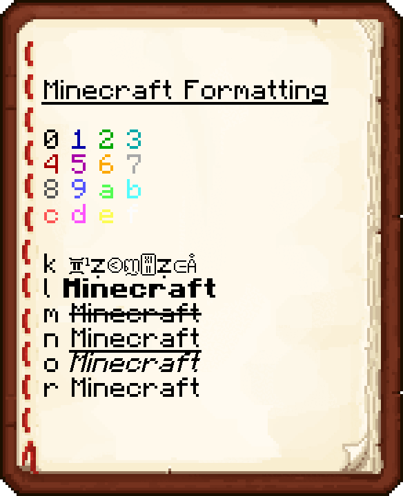

# Цветные названия предметов

Достаточно взять предмет в руку и прописать одну из команд ниже:

`/renameitem <название предмета>` - изменить название предмета

`/sign <текст описания>` - изменить описание предмета

`/sign delete` - удалить описание предмета

Доступны цвета из ванильного майнкрафта, их необходимо прописывать через & (например &4text) И цвета в формате \&#000000 (например &[#94a6b4](https://www.color-hex.com/color/94a6b4)). Также из них можно делать градиенты!

| Код  | Название          |
| ---- | ----------------- |
| `&0` | Чёрный            |
| `&1` | Тёмно-синий       |
| `&2` | Тёмно-зелёный     |
| `&3` | Темно-бирюзовый   |
| `&4` | Тёмно-красный     |
| `&5` | Тёмно-фиолетовый  |
| `&6` | Золотой           |
| `&7` | Серый             |
| `&8` | Тёмно-серый       |
| `&9` | Синий             |
| `&a` | Зелёный           |
| `&b` | Бирюзовый         |
| `&c` | Красный           |
| `&d` | Светло-фиолетовый |
| `&e` | Жёлтый            |
| `&f` | Белый             |

Форматирование текста тоже доступно:

#### \&k - магический (запутанный) \&l - толстый \&m - зачеркнутый \&n - подчеркнутый \&o - курсив (под наклоном) \&r - сброс 

Удобный сайт для создания градиента — [тык](https://www.birdflop.com/resources/rgb/)&#x20;

<figure><figcaption>
И содержимое строки output вы вставляете в нужную команду
</figcaption></figure>

<figure><figcaption></figcaption></figure>
