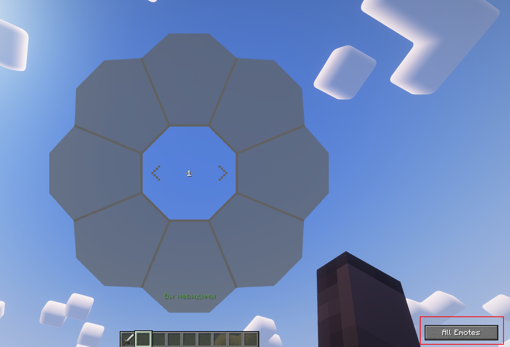

# Emotecraft

**На сервере есть плагин для** [**эмоций**](https://modrinth.com/plugin/noemotecraft)**, с помощью него вы можете выражать свои эмоции без слов!**\
\
[SPEmotes](https://docs.google.com/document/d/1AK0w8M1\_oZ3Z3VxoETT4QJ-OjVsP1AzqE0kHhSazymQ) - Большой пак эмоций, использующийся многими людьми.\
\
Помещать по пути:`C:\Users\ВашПользователь\AppData\Roaming.minecraft\emotes.`

## <mark style="color:red;">**Возможные ошибки!**</mark>

**Не сгибаются конечности:**

Для исправления этой ошибки необходимо установить последние версии **Sodium** и **Iris.** Также настоятельно советую установить такие моды как [ETF](https://modrinth.com/mod/entitytexturefeatures) и [EMF](https://modrinth.com/mod/entity-model-features) для избежения последующих ошибок.

**Останавливается эмоция при движении:**\
\
Для того чтобы исправить данную ошибку вам необходимо нажать на "**B**", а далее следовать скриншотам ниже.\

<figure><figcaption></figcaption></figure>

<figure><figcaption></figcaption></figure>

<figure><figcaption></figcaption></figure>

<figure><figcaption>
Данный ползунок выкручиваем на максимум.
</figcaption></figure>

## Опа! И всё, теперь вы можете спокойно двигаться при эмоциях, для того чтобы ее остановить нажмите "**SHIFT**"&#x20;
